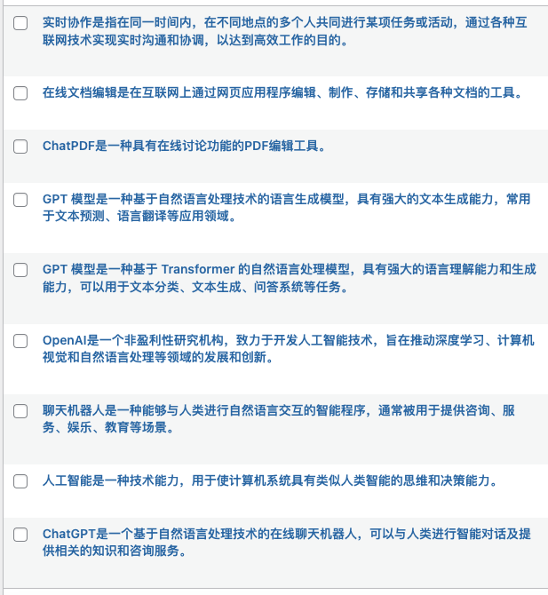

# chat_wordpress
基于 ChatGPT 一个关键词批量自动生成内容，批量自动发布到 WordPress。

##  原理 
“道生一，一生二，二生三，三生万物”出自老子的《道德经》第四十二章，是老子的宇宙生成论。

1.根据给定关键词，生成相关关键词；根据生成相关关键词，继续寻找它们的相关关键词。

2.根据关键词让 ChatGPT 写一篇文章。

3.自动发布到  WordPress

##  工具链

1.ChatGPT 寻找相关关键词，并生成内容。

2.wordpress_xmlrpc 用于自动发布到 WordPress

##  在线 Demo

初始关键词为  中国百家姓有哪些[广度优先 Demo]

[http://zhouyiming.net/](http://zhouyiming.net/)

初始关键词为  ChatGPT [深度优先 Demo]

http://entropyengine.cn/?p=82

[http://entropyengine.cn/](http://entropyengine.cn/)

## 快速开始

WordPress 配置项
domain_name=""
user_name=""
password=""

OpenAI 配置项
openai.api_key = "sk-chat_wordpress"

## 文章截图

## 更多玩法

[http://chatnews.cn/](http://chatnews.cn/)

